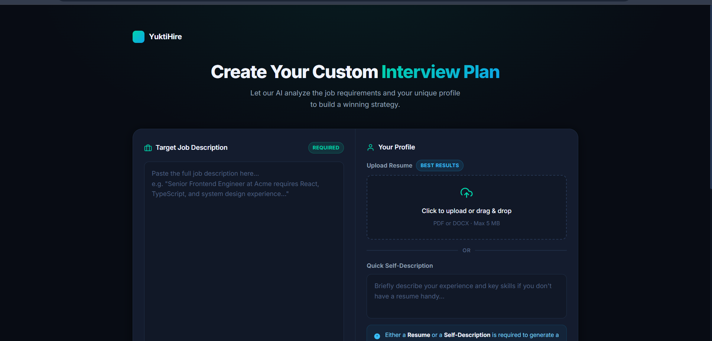
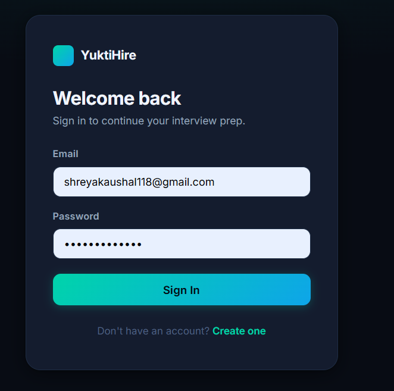
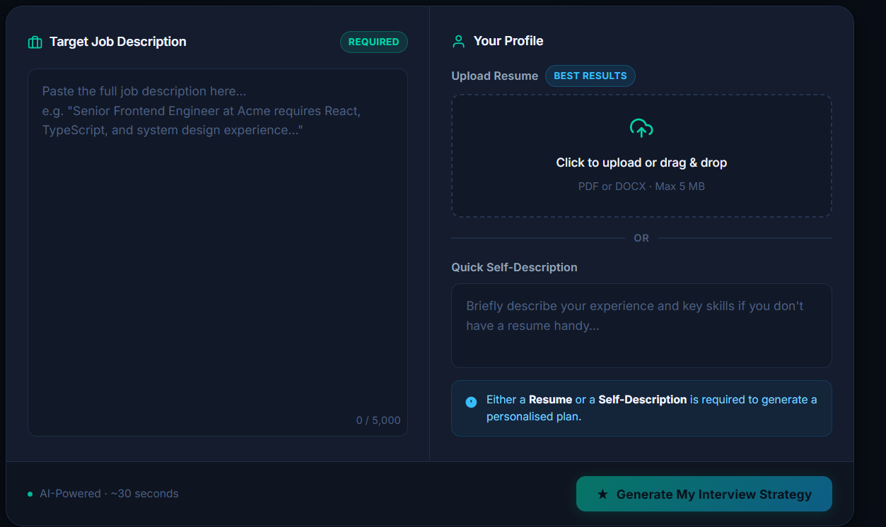
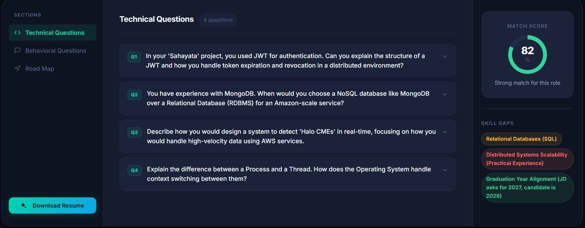
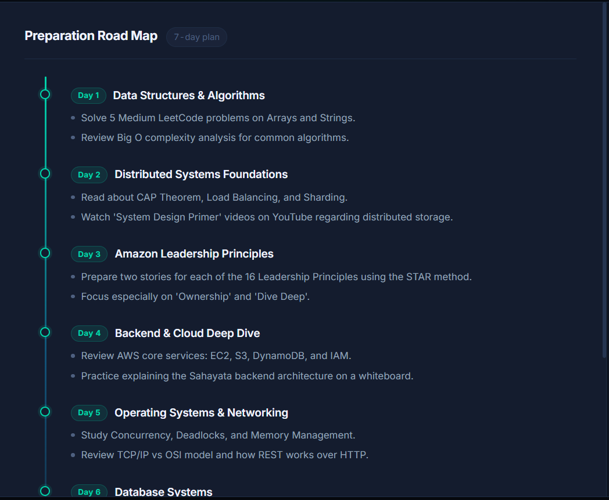

<div align="center">

# YuktiHire

### Gen AI-Powered Interview Preparation Platform

YuktiHire analyzes a candidate's resume and a job description to generate interview reports, targeted questions, skill gap insights, and ATS-friendly resume support.


</div>

---

## Table of Contents

- [Overview](#-overview)
- [Screenshots](#-screenshots)
- [Features](#-features)
- [Tech Stack](#-tech-stack)
- [Prerequisites](#-prerequisites)
- [Installation](#-installation)
- [Environment Variables](#-environment-variables)
- [Running the Project](#-running-the-project)
- [Directory Structure](#-directory-structure)
- [Notes](#-notes)
- [License](#-license)

---

## Overview

This repository contains two separate applications:

| App | Description |
|---|---|
| `Backend/` | Node.js + Express API server with MongoDB, authentication, resume parsing, and AI report generation. |
| `Frontend/` | Vite-powered React application with authentication, interview flow, report viewing, and PDF resume download. |

---

## Live Demo

- https://yuktihire-frontend.onrender.com/login

> If your Render service URLs are different, update these links to match your actual deployed domains.

---

## Screenshots


<div align="center">

### Landing Page


### Login / Authentication


### Resume Upload & Job Description Input


### AI-Generated Interview Report


### Skill Gap & Roadmap View


</div>


---

## Features

- JWT authentication with token blacklisting
- Resume upload and parsing
- AI-powered interview report generation
- Technical and behavioral question suggestions
- Personalized preparation roadmap
- Resume PDF export
- Recent report history and report detail views

---

## Tech Stack

**Backend**
- Node.js, Express
- MongoDB, Mongoose
- bcryptjs, jsonwebtoken, dotenv
- multer, pdf-parse, Puppeteer
- Google GenAI

**Frontend**
- React, Vite
- React Router, Axios
- SCSS
- @vitejs/plugin-react

---

## Prerequisites

- Node.js 18+
- MongoDB Atlas or a local MongoDB instance

---

## Installation

### Backend

```bash
cd Backend
npm install
```

### Frontend

```bash
cd Frontend
npm install
```

---

## Environment Variables

Create a `.env` file inside `Backend/` with the following:

```dotenv
MONGO_URI=your_mongo_connection_string
JWT_SECRET=your_jwt_secret
JWT_EXPIRES_IN=7d
GOOGLE_GENAI_API_KEY=your_google_genai_api_key
CLIENT_URL=http://localhost:5173
```

For frontend builds, set `VITE_API_BASE_URL` in `Frontend/.env` or in Render environment variables to your backend URL.

---

## Running the Project

Open two terminals — one for the backend, one for the frontend.

### Start backend

```bash
cd Backend
npm start
```

Runs on **`http://localhost:3000`**

### Start frontend

```bash
cd Frontend
npm run dev
```

Runs on **`http://localhost:5173`** (or the next available port if `5173` is in use)

---

## Directory Structure

### Backend

```
Backend/
├── src/
│   ├── app.js
│   ├── config/
│   │   └── database.js
│   ├── controller/
│   │   ├── auth.controller.js
│   │   └── interview.controller.js
│   ├── middlewares/
│   │   ├── auth.middleware.js
│   │   └── file.middleware.js
│   ├── models/
│   │   ├── blacklist.model.js
│   │   ├── interviewReport.model.js
│   │   └── user.models.js
│   ├── routes/
│   │   ├── auth.routes.js
│   │   └── interview.routes.js
│   └── services/
│       └── ai.service.js
├── server.js
└── .env
```

### Frontend

```
Frontend/
├── public/
├── src/
│   ├── app.jsx
│   ├── app.routes.jsx
│   ├── main.jsx
│   ├── style.css
│   ├── features/
│   │   ├── auth/
│   │   └── interview/
│   └── assets/
├── vite.config.js
├── package.json
└── package-lock.json
```

---

## Notes

- The backend and frontend are run separately, in different folders.
- If Vite opens on a different port, use the port printed in the terminal.
- Make sure the MongoDB connection string and API key are valid in `Backend/.env`.

---

## Useful Commands

| Location | Command | Description |
|---|---|---|
| `Backend/` | `npm start` | Starts the API server |
| `Frontend/` | `npm run dev` | Starts the Vite dev server |

---

